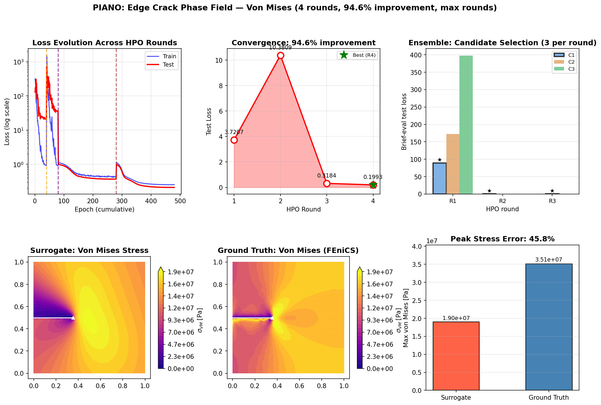

# PIANO

**P**hysics-**I**nformed **A**gentic **N**eural **O**perator

PIANO is a self-improving surrogate framework for computational mechanics. It combines neural operator architectures (Transolver and DeepONet) with physics-informed loss (PINO) and an **autonomous 3-agent HPO system** that diagnoses training issues and proposes fixes — without manual tuning.

The agentic loop is inspired by [AgenticSciML (Jiang, 2024)](paper/AGENTICSCIML_QJiang.pdf) and implements three key ideas from that paper: a structured Critic–Architect debate, best-config selection across rounds, and persistent failure memory fed back to the Architect.

---

## Demo Result

Edge-crack phase field fracture: 40 samples (pre-generated FEniCS AT-2), up to 6 agentic HPO rounds, joint prediction of `[u_x, u_y, log1p(σ_vm)]`. Physics terms enabled sequentially by the Physicist agent, including the peridynamic equilibrium residual.



**Top row (left to right):**
- **Loss evolution** — cumulative training and test loss across all HPO rounds; round boundaries marked
- **HPO convergence** — test loss per round with best-round annotation
- **Physics weight progression** — Physicist sequentially enables equilibrium → energy → traction_free → near_tip (PD)

**Bottom row (left to right):**
- **Surrogate** — predicted von Mises stress (inverted from `log1p` prediction)
- **Ground Truth** — FEniCS AT-2 phase field solution (degraded stress, correct tip concentration)
- **Peak stress comparison** — bar chart of surrogate vs GT peak σ_VM with percentage error

### Run the Demo

```bash
# Default: 40 samples from disk, 80 epochs/round, up to 6 rounds (mock LLM, no FEniCS needed)
python scripts/generate_phase_field_demo.py

# Faster run
python scripts/generate_phase_field_demo.py --epochs 40 --rounds 4

# Custom output path
python scripts/generate_phase_field_demo.py --output my_demo.png
```

---

## What Makes PIANO Different?

Traditional neural operators require manual hyperparameter tuning. PIANO uses **LLM-based agents** that automatically diagnose training issues, debate solutions, and propose fixes:

```
┌──────────────────────────────────────────────────────────────────────┐
│                    3-AGENT HPO SYSTEM (with Debate)                   │
├──────────────────────────────────────────────────────────────────────┤
│                                                                        │
│         Train from best known config (Gap 2: best-config select)       │
│                              ↓                                         │
│                    ┌─────────────────┐                                 │
│                    │  CRITIC AGENT   │ ← failure memory (Gap 3)        │
│                    │  Analyzes loss  │                                 │
│                    │  curves via LLM │                                 │
│                    └────────┬────────┘                                 │
│                             ↓                                          │
│                    ┌─────────────────┐                                 │
│                    │ ARCHITECT AGENT │ ← best_config + attempt history │
│                    │  Proposes config│                                 │
│                    └────────┬────────┘                                 │
│                             ↓                                          │
│                    ┌─────────────────┐                                 │
│                    │  CRITIC reviews │ ← structured debate (Gap 1)     │
│                    │  proposal for   │                                 │
│                    │  feasibility    │                                 │
│                    └────────┬────────┘                                 │
│                             ↓ (revise if not feasible)                 │
│              ┌──────────────┴──────────────┐                           │
│              ↓                              ↓                          │
│    ┌─────────────────┐            ┌─────────────────┐                  │
│    │ ARCHITECT AGENT │            │ PHYSICIST AGENT │                  │
│    │ (final config)  │            │ sequential      │                  │
│    │ • arch_type     │            │ physics enabling│                  │
│    │ • d_model       │            │ eq → energy →   │                  │
│    │ • learning_rate │            │ traction_free → │                  │
│    │ • dropout       │            │ → near_tip (PD) │                  │
│    │ • trunk_dropout │            │ → j_integral    │                  │
│    └────────┬────────┘            └────────┬────────┘                  │
│             └──────────────┬───────────────┘                           │
│                            ↓                                           │
│                     Merge & Retrain                                    │
└──────────────────────────────────────────────────────────────────────┘
```

### Three paper-inspired improvements (AgenticSciML, Jiang 2024)

**Gap 1 — Structured Critic–Architect debate:**
After the Architect proposes a config, the Critic reviews it for feasibility. If the proposal doesn't address the diagnosed issue (e.g. overfitting proposal has no regularisation), the Architect revises before training begins. This prevents wasted FEM/training budget on obviously wrong configs.

**Gap 2 — Best-config selection:**
The Architect always receives the configuration that achieved the best test loss so far, not the most recent one. When a round gets worse, the next proposal builds on the best known state rather than the regressed state.

**Gap 3 — Failure memory:**
Every completed round appends a plain-text summary `(round, changes, train_loss, test_loss, diagnosis)` to `attempt_history`. This is passed to the Architect so it never repeats a failed strategy.

---

## The Agents

### 1. HyperparameterCriticAgent
**Role:** Training diagnostician + proposal reviewer (LLM-required)

Analyzes loss curves to detect:
- `OVERFITTING` — train/test loss divergence
- `UNDERFITTING` — both losses high, model not learning
- `SLOW_CONVERGENCE` — gradual improvement but far from optimal
- `LOSS_PLATEAU` — no improvement for many epochs
- `UNSTABLE_TRAINING` — large epoch-to-epoch fluctuations
- `GRADIENT_EXPLOSION` — NaN values detected

Also implements `review_proposal()` — the debate round 2 method that checks whether an Architect proposal addresses the diagnosed issue and returns `feasible`, `concerns`, `suggestion`.

Requires `set_llm_provider()` before `analyze_training()` or `review_proposal()` — raises `RuntimeError` otherwise. Lightweight heuristics (`detect_issues_heuristic`) remain available for gating decisions (e.g. `should_trigger_hpo`) but are not used as an LLM substitute.

### 2. ArchitectAgent
**Role:** Neural network architect

Selects architecture and proposes hyperparameters based on the Critic's diagnosis, the best known config, and the full attempt history:

| Concern | Parameters |
|---------|------------|
| Architecture | `arch_type` (transolver \| deeponet), `d_model`, `n_layers`, `n_heads` |
| Optimization | `learning_rate`, `optimizer_type`, `scheduler_type` |
| Regularization | `dropout` (branch), `trunk_dropout` (trunk — independent) |
| Capacity | `slice_num`, `hidden_dim`, `n_basis` |

**Architecture selection:**
- `transolver` — varied geometry or large datasets (> 200 samples)
- `deeponet` — fixed geometry + small datasets (< 100 samples)

### 3. PhysicistAgent
**Role:** Physics loss specialist

Sequentially enables fracture mechanics terms — each term is only activated once the previous one has stabilised:

```
equilibrium → energy → traction_free → near_tip → j_integral
```

| Term | What it enforces | Activated when |
|------|-----------------|----------------|
| `equilibrium` | Nodal force balance residual (label-free) | Round 1 |
| `energy` | Strain energy norm consistency | Equilibrium stable |
| `traction_free` | σ = 0 on crack/notch faces | Energy stable |
| `near_tip` | Peridynamic equilibrium: Σ_j (1−d_ij)² s_ij ê_ij = 0 | BC stable |
| `j_integral` | Domain J = K_I²/E | All others stable |

If the physics-to-data loss ratio exceeds 10%, the Physicist halves all active weights to prevent physics from overriding the data signal.

---

## Neural Architectures

### Transolver (default for large datasets)
Physics-Attention transformer operator. Learns mappings over unstructured meshes via sliced attention over geometry-aware tokens.

### DeepONet (selected for small datasets)
Branch-trunk neural operator. Separates parameter dependence from spatial representation:

```
output(x; μ) = Σ_k  branch_k(μ) × trunk_k(x)  + bias
```

- **Branch** encodes *what* — how parameters (E, ν, traction, K_I) modulate the field
- **Trunk** encodes *where* — spatial basis functions over enriched coordinates

**Two independent dropout rates:**
- `dropout` — branch MLP regularisation (keep low; branch just maps parameters to coefficients)
- `trunk_dropout` — trunk MLP regularisation (prevents oscillatory basis function artifacts in the far-field; both tunable by the Architect agent)

**Singularity-aware trunk coordinates:**
Raw `(x, y)` are enriched with polar features relative to the notch/crack tip:
```
[x, y, r, log(r), sin(θ), cos(θ)]
```
`log(r)` is the key feature since `log(σ) ≈ log(K_I) − 0.5·log(r)` near the tip. `sin/cos(θ)` replaces raw `atan2` to avoid the ±π branch-cut discontinuity that causes swirling artifacts in the far-field.

---

## Physics-Informed Training

### Training Target: Displacement Field
The surrogate predicts nodal **displacement** `(N, 2)` in physical units. Von Mises stress is derived from the predicted displacement at evaluation time via the plane-stress constitutive law (CST B-matrix). This keeps the output space physics-consistent and enables the PINO loss.

### Tip-Weighted MSE
Nodes near the notch tip get higher loss weight: `w_i = 1 + tip_weight / r_i`, normalized so `mean(w) = 1`. This prevents the model from ignoring the singularity in favour of the smooth far-field.

### PINO Loss
```
L_total = L_MSE + pino_weight × L_energy + pino_eq_weight × L_equilibrium
```

| Term | Formula | Labels needed |
|------|---------|---------------|
| `L_energy` | Strain energy of prediction error: `Σ_e (ε_err^T C ε_err A_e) / Σ A_e` | Yes (displacement GT) |
| `L_equilibrium` | Nodal force residual: `‖Σ_e B_e^T C B_e u_e A_e‖² / N` | No (label-free) |

Both terms use fully differentiable PyTorch `einsum` + `scatter_add_`. Coordinates are always sliced to `(x, y)` before being passed to the physics losses, so enriched 6-feature trunk inputs are handled correctly.

### Fracture Mechanics Loss (CrackFractureLoss)
Three additional terms enabled sequentially by the Physicist:
- **Crack face BC** — traction-free condition on crack/notch faces (normalised by `K_I²/(2π·r_min)` for scale consistency)
- **Peridynamic equilibrium** — bond-based residual `Σ_j (1−d_ij)² s_ij ê_ij = 0` at every node; valid across the full mesh and inside large phase-field damage zones; when `crack_config=None` (phase field), runs as a standalone `PeridynamicEquilibriumLoss` module requiring no K_I input
- **J-integral** — domain J = K_I²/E (plane stress)

---

## Project Structure

```
piano/
├── surrogate/                   # Neural operator training
│   ├── transolver.py           # Transolver (Physics-Attention)
│   ├── deeponet.py             # DeepONet (Branch-Trunk operator)
│   ├── trainer.py              # Training loop (PINO-enabled, coord slicing)
│   ├── agentic_trainer.py      # 3-agent HPO wrapper
│   ├── ensemble.py             # Ensemble (seed-diverse members)
│   ├── pino_loss.py            # PINO elasticity loss (equilibrium + energy)
│   ├── crack_pino_loss.py      # Fracture mechanics loss (K_I, traction-free, PD, J-integral)
│   ├── peridynamic_loss.py     # Bond-based peridynamic equilibrium residual (standalone)
│   └── base.py                 # TransolverConfig, DeepONetConfig, CrackConfig (horizon_factor)
│
├── agents/                      # LLM-based agents
│   ├── base.py                 # BaseAgent, AgentContext
│   ├── roles/
│   │   ├── hyperparameter_critic.py  # Diagnosis + proposal review (debate)
│   │   ├── architect.py              # Architecture, optimizer, trunk_dropout tuning
│   │   └── physicist.py              # Sequential physics loss enabling
│   └── llm/                    # Providers: Anthropic (Claude 4), OpenAI
│
├── data/                        # Dataset utilities
│   ├── dataset.py              # FEMDataset, FEMSample (with elements field)
│   └── phase_field_generator.py  # FEniCS AT-2 phase field fracture data generation
│
├── geometry/                    # Mesh generation
│   ├── notch.py                # V-notch geometry + mesh (filters notch interior)
│   └── crack.py                # Edge crack geometry
│
├── mesh/                        # Mesh handling
│   └── fenics_manager.py       # FEniCS mesh + function space management
│
└── solvers/                     # FEM solvers
    └── fenics_phase_field.py   # FEniCS AT-2 phase field fracture (staggered scheme)
```

---

## Configuration

### DeepONetConfig (small datasets, fixed geometry)

| Parameter | Default | Agent-tunable | Description |
|-----------|---------|---------------|-------------|
| `hidden_dim` | 64 | Architect | MLP width for branch and trunk |
| `n_basis` | 32 | Architect | Number of shared spatial basis functions |
| `n_layers` | 3 | Architect | MLP depth |
| `dropout` | 0.0 | Architect | Branch dropout |
| `trunk_dropout` | 0.1 | Architect | Trunk dropout (prevents oscillatory basis artifacts) |
| `learning_rate` | 1e-3 | Architect | Learning rate |
| `optimizer_type` | "adamw" | Architect | Optimizer |
| `scheduler_type` | "cosine" | Architect | LR scheduler |
| `output_dim` | 2 | Fixed | Displacement field (x, y) |

### TransolverConfig (large datasets, varied geometry)

| Parameter | Default | Agent-tunable | Description |
|-----------|---------|---------------|-------------|
| `d_model` | 128 | Architect | Hidden dimension |
| `n_layers` | 6 | Architect | Transformer layers |
| `n_heads` | 8 | Architect | Attention heads (must divide d_model) |
| `slice_num` | 64 | Architect | Physics-attention slices |
| `dropout` | 0.0 | Architect | Dropout rate |
| `learning_rate` | 1e-3 | Architect | Learning rate |
| `equilibrium` | 0.01 | Physicist | Equilibrium residual weight (enabled round 1) |
| `energy` | 0.0 | Physicist | Strain energy loss weight |
| `traction_free` | 0.0 | Physicist | Crack face BC weight |
| `near_tip` | 0.0 | Physicist | Peridynamic equilibrium residual weight |
| `tip_weight` | 2.0 | Fixed | Notch-tip loss amplification |
| `output_dim` | 2 | Fixed | Displacement field (x, y) |

---

## Known Limitations

**Mock LLM critic cannot detect regime shift (overfitting after round 2)**
When using `MockLLMProvider`, the critic reads actual train/test losses from the prompt and returns OVERFITTING when the ratio exceeds 5×. However, the mock Architect's config repertoire is limited to three pre-written responses per issue type. For full benefit of the debate loop and failure memory, use `--use-real-llm`.

**Peak stress error remains high (~55%) with 30 samples**
The surrogate predicts displacement (smooth field); Von Mises is derived post-hoc via the B-matrix. Near-tip derivative amplification means small displacement errors produce large stress errors. Mitigation: more samples, higher `tip_weight`, or direct stress supervision.

---

## Installation

```bash
git clone https://github.com/your-username/PIANO.git
cd PIANO
pip install -e ".[all]"
pip install pytest-asyncio  # required for async agent tests
```

FEniCS (dolfinx) is required for real FEM data generation. The demo uses AT-2 phase field fracture solved with FEniCS; if unavailable the demo can be run with pre-generated data in `phase_field_data/`.

**LLM provider:** Set `ANTHROPIC_API_KEY` in your environment and pass `--use-real-llm` to use Claude 4 (`claude-haiku-4-5-20251001` by default) for all three agents. Without it, `MockLLMProvider` is used for development and testing.

---

## References

- Jiang (2024): *AgenticSciML* — evolutionary multi-agent system for SciML (inspiration for debate loop, best-config selection, failure memory)
- Wu et al. (2024): *Transolver: A Fast Transformer Solver for PDEs on General Geometries*, ICML 2024
- Lu et al. (2021): *Learning Nonlinear Operators via DeepONet*, Nature Machine Intelligence
- Li et al. (2024): *Physics-Informed Neural Operator for Learning Partial Differential Equations*
- Silling (2000): *Reformulation of elasticity theory for discontinuities and long-range forces*, J. Mech. Phys. Solids — peridynamic equilibrium loss
- Bobaru & Hu (2012): *The meaning, selection, and use of the peridynamic horizon*, Int. J. Fract. — horizon selection (δ = 3h)
- Bourdin et al. (2000): *Numerical experiments in revisited brittle fracture*, J. Mech. Phys. Solids — AT-2 phase field model
- [FEniCS/dolfinx](https://fenicsproject.org/) — phase field fracture solver

---

## License

BSD 3-Clause. See [LICENSE](LICENSE) for details.

## Authors

- Hyun-Young Nam (hyun_young_nam@brown.edu)
- Qile Jiang (qile_jiang@brown.edu)
